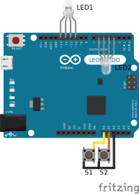

# DIY-8-Button-Keypad
Repository for the 8-button keypad project

Using 2 keys Z and X for Osu! with RGB LEDs, current limited via PWM and Common Anode by default

Current pin layout with Arduino Leonardo:

